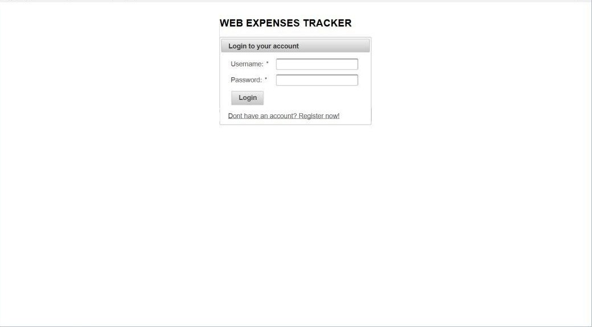
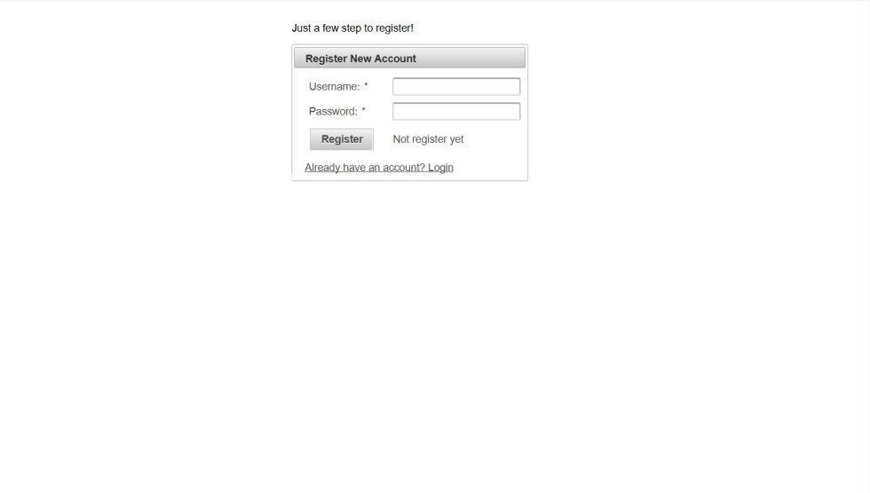
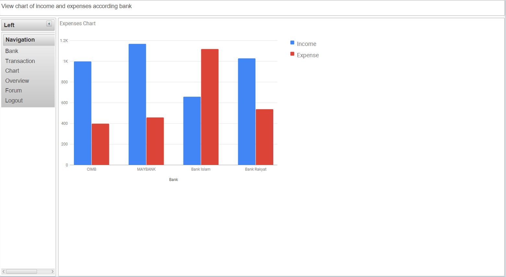

# WEB EXPENSES TRACKER
Component Base Group Project Repository

This is a Web Expense Tracker
Website that used to track all of your expense and saving for multiple saving acccount
It uses Google Web Services.

What the website can do?
1. Able to create,save,edit and delete saving account
2. Able to save,edit and delete expenses and saving details
3. Able to view all expenses and saving in one dahsboard (graph/chart)
4. Able to create personal account and login to it.

# OVERVIEW/SCREENSHOT

Login page

Register page

Add Transaction Page

Add Bank Page

Overview Account Page

